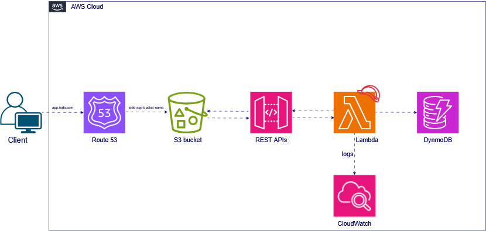

# Manara Project - Serverless Architecture Documentation

## Project Overview

Manara is a serverless application built on AWS cloud services, implementing a REST API for managing to-do lists and customer records. The architecture leverages various AWS services to create a scalable, maintainable, and secure solution.

## Project Diagram

## Architecture Components

### DNS Layer (Route 53)
- Domain name registration and management
- DNS routing policies (weighted, latency-based, geolocation)

### Frontend Layer (S3)
- Static website hosting on Amazon S3
- Direct integration with API Gateway
- Responsive web interface for CRUD operations
- Secure access through HTTPS

### API Layer (API Gateway)
- RESTful endpoints for all CRUD operations
- Request validation and transformation
- API versioning support
- CORS configuration
- Rate limiting and throttling

### Logic (Lambda)
- Serverless functions for each CRUD operation
- Event-driven architecture
- Stateless execution
- Automatic scaling based on demand
- Node.js runtime environment

### Data Layer (DynamoDB)
- NoSQL database for data persistence
- Flexible schema design
- Automatic scaling
- Support for both document and key-value data models
- Optimized for high-performance CRUD operations

## Security Implementation

### AWS IAM
- Fine-grained access control
- Role-based authentication
- Resource-based policies
- Least privilege principle implementation

## Monitoring and Logging

### CloudWatch Integration
- Real-time monitoring
- Custom metrics and dashboards
- Log aggregation
- Automated alerting
- Performance metrics tracking

